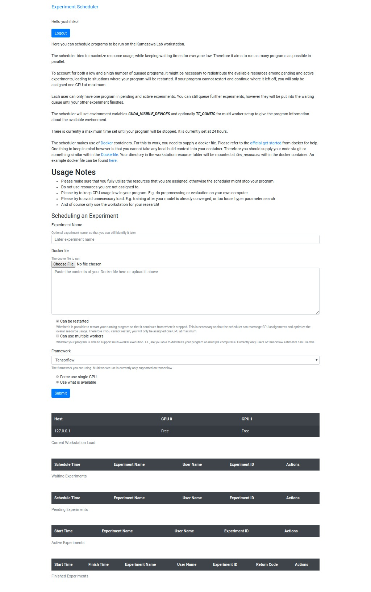

# Experiment Scheduler

The web-based scheduler tool to allow

1. multiple people share GPU workstations and
2. see the status, stdout and stderr of exeperiments
3. control experiments (start, stop).


# Features

This sheduler is designed to **miximize** the usage of GPU workstation
and provide **fair and even** computation resources to people.


# Environment encapsulation

To allow everyone have their own environment for their experiments without
interferring other poeple's environment, this scheduler will use docker containers
to encapsulate each experiments.


# Dependencies

* Docker
* Python3
* At least one GPU
* LDAP
* LDAP authentication server


# Installation

```bash
# clone the scheduler from github
git clone https://github.com/yoshihikoueno/ExperimentScheduler
cd ExperimentScheduler

# [optional but recommended] prepare virtual environment for python packages
python3 -m venv env
source env/bin/activate

# install required packages
pip3 install -r requirements.txt
```

It'll be also required to setup authentication stuff.
Please refer to external guide for setting up LDAP authentication server
and client.

# Usage

Example

```bash
python3 main.py  --logdir /tmp --public
```

options

```bash
python main.py --help

# usage: main.py [-h] [--logdir LOGDIR] [--config CONFIG] [--public]
#                [--port PORT]
# 
# optional arguments:
#   -h, --help       show this help message and exit
#   --logdir LOGDIR  Directory where all log files should be stored
#   --config CONFIG  Config file for the scheduler
#   --public         Whether to publish web server to the local network
#   --port PORT      The port to use for the web interface. Defaults to 5000
```

# Screenshot




# NOTE

This scheduler is developed as an **internal** tool to make it easier
to schedule experiments on a server, so the documentation and implementation
may not be appropriate for general usage outside our environment.
